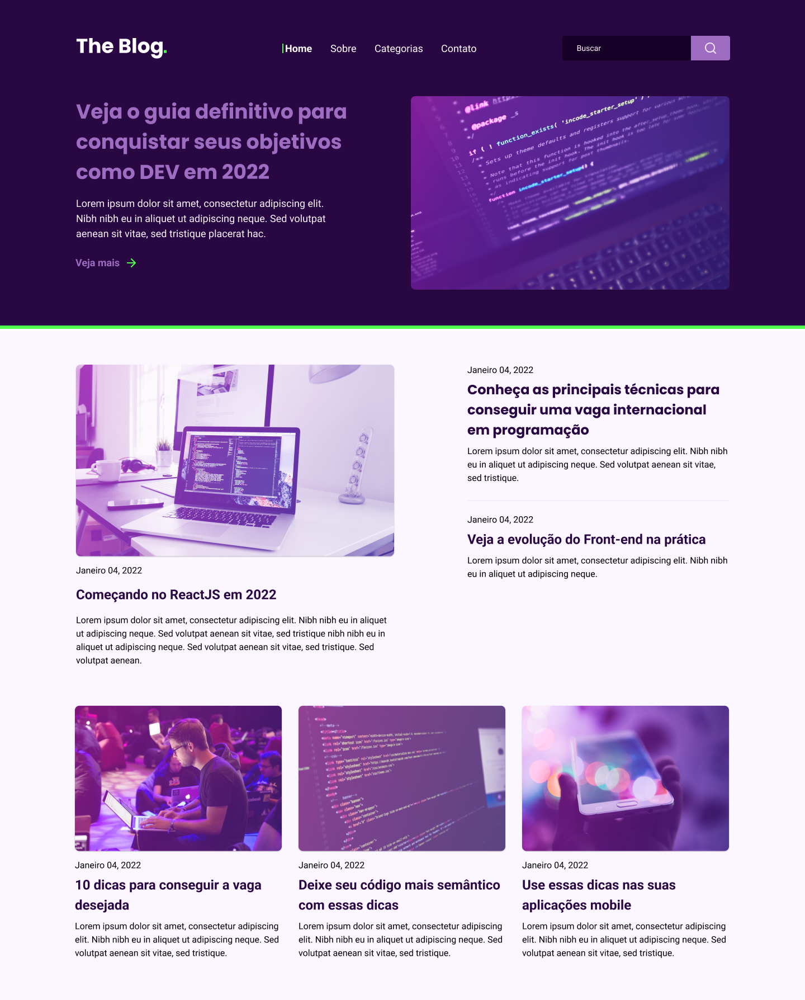

<h1 align="center"> The blog </h1>

Neste desafio você irá desenvolver uma homepage para um blog.

  <a href="#-tecnologias">Tecnologias</a>&nbsp;&nbsp;&nbsp;|&nbsp;&nbsp;&nbsp;
  <a href="#-projeto">Projeto</a>&nbsp;&nbsp;&nbsp;|&nbsp;&nbsp;&nbsp;
  <a href="#-layout">Layout</a>&nbsp;&nbsp;&nbsp;|&nbsp;&nbsp;&nbsp;
  <a href="#memo-licença">Licença</a>

  

 

  

## 🚀 Tecnologias

Esse projeto foi desenvolvido com as seguintes tecnologias:

- HTML e CSS
- JavaScript

## 💻 Projeto

Um projeto que utiliza elementos que será usado no dia a dia como programador web, utilizando tecnicas com:
<ul>
<li>Display flex</li>
<li>Display Grid</li>
<li>Utilização de variáveis</li>
Entre outras

</ul>

## 🔖 Layout

Você pode visualizar o layout do projeto através [DESSE LINK](https://www.figma.com/file/sqnQH76d9OiYPGKpD3tr2G/DD-%2F-RocketBlog-(Copy)?node-id=312%3A152). É necessário ter conta no [Figma](https://figma.com) para acessá-lo.

## :memo: Licença 

Esse projeto está sob a licença MIT.

---

Feito com ♥
